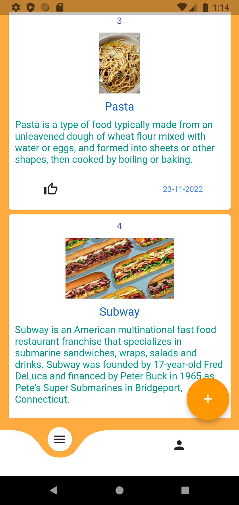

# MyWall
MyWall is a perfect alternative for any blog app. Create and Store your blogs with =MyWall=. Created with Flutter/Dart and Firebase

# Tech Used
## Frontend
- Flutter
## Backend
- Firebase
## Database
- FirebaseAuth - Login and Registration
- FirebaseStorage - Storing Blog Images

## How to start this project
```bash
flutter clean
```
```bash
flutter pub get
```
```bash
flutter run
```

## Sample Images of UI Screen
<p float="left" align="middle">



</p>
